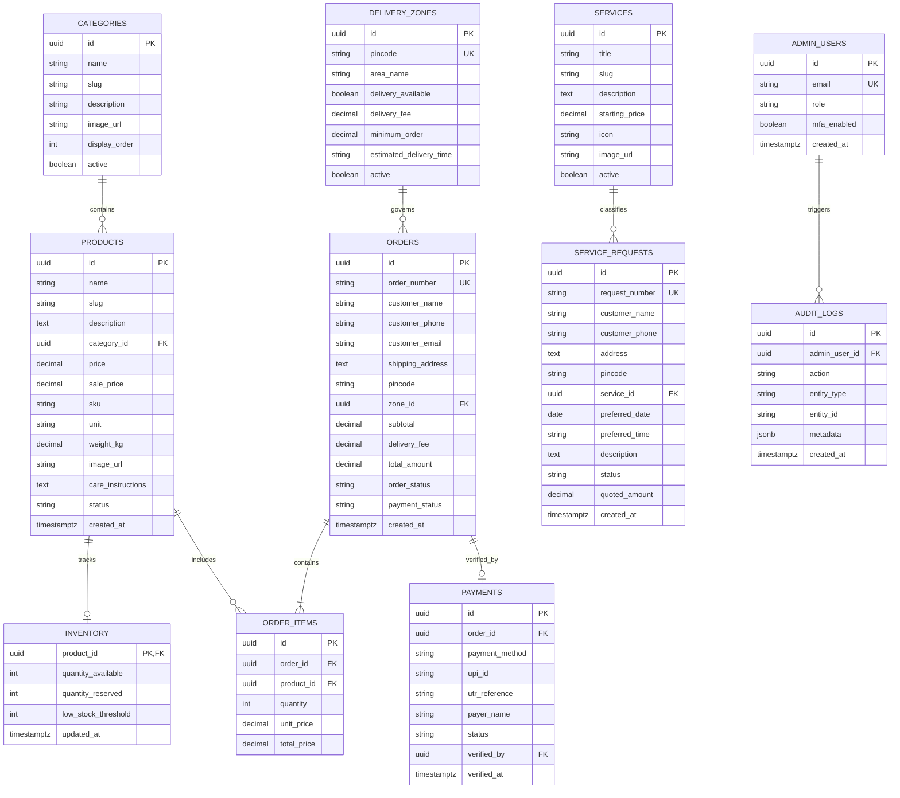
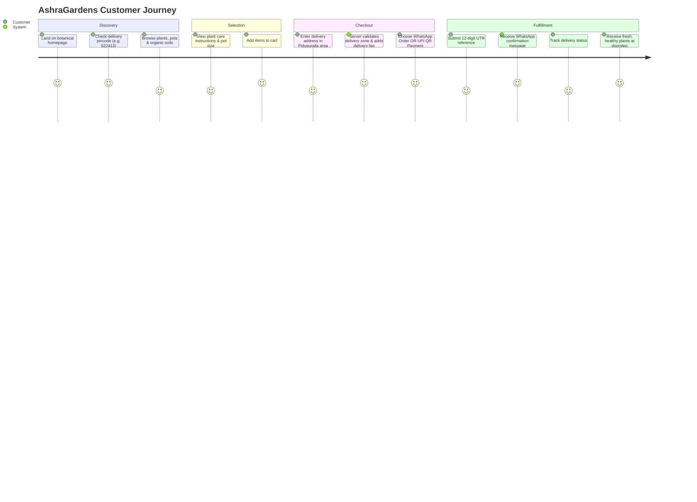
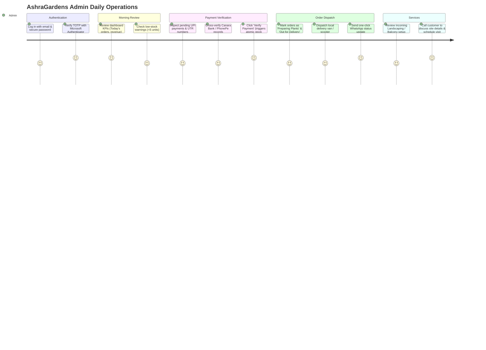

# AshraGardens — Comprehensive Architecture & Migration Plan

**Project:** AshraGardens (Nursery, Garden Supplies, Landscaping & Local Plant Delivery)  
**Reference Codebase:** `D:\Madhusboteque` (Read-only architectural template; strictly unmodified)  
**Target Repository:** `D:\ashragardens`  
**Business Hub:** Mayabazar, Piduguralla, Palnadu District, Andhra Pradesh (PIN: 522413)  
**Contact / WhatsApp:** +91 9491366841 | **Email:** ashragardens@gmail.com  
**UPI ID:** `pathankhandme1@ybl` (Mahaboob Khan Pathan, Canara Bank A/C ending 7489)  

---

## 1. Architecture Comparison

| Architectural Dimension | Madhus Boutique (Reference) | AshraGardens (Target) |
| :--- | :--- | :--- |
| **Business Model** | Digital Embroidery Machine Design Store | Physical Plants, Nursery Supplies & Gardening Services |
| **Product Nature** | Purely digital download assets (`.dst`, `.pes`, `.jef`, `.exp`) | Physical living saplings, heavy ceramic/plastic pots, soils, tools |
| **Storage Architecture** | AWS S3 with presigned URLs & private encrypted buckets | Local public assets (`/public/images/`) & repository-contained media (Zero S3 dependency) |
| **Packaging & Fulfillment** | On-the-fly multi-file ZIP generation (`jszip`) | Local delivery within 30 km radius of Piduguralla |
| **Inventory Logic** | Unlimited digital license copies | Real physical stock with atomic decrement & reservation |
| **Location Validation** | Worldwide digital delivery (no geo-restrictions) | Strict server-side / client-side delivery zone check by Pincode |
| **Services Component** | None (pure e-commerce) | Dedicated Gardening & Landscape Service Request Workflow |
| **Payment Flow** | UPI QR + UTR submission + Admin verification | V1: Direct WhatsApp checkout & PhonePe UPI QR<br>V2: On-site UTR verification & payment gateway |
| **UI Aesthetics** | Luxury embroidery boutique (Maroon, Gold, Stitching loops) | Modern, fresh, organic botanical design (Emerald, Forest, Sage, Warm Amber) |
| **Framework & Tech** | Next.js 16 + React 19 + Tailwind v4 + shadcn/ui | Modern Next.js 16/17 App Router + React 19 + Tailwind v4 + Lucide Icons |

---

## 2. 24-Module Classification Matrix

| Module | Classification | Rationale & Architectural Strategy |
| :--- | :---: | :--- |
| **1. Next.js App Structure** | **REUSE** | Keep modern App Router (`src/app`), layout nesting, server components, and dynamic route segments. |
| **2. UI Component System** | **MODIFY** | Upgrade shadcn/ui primitives (`Button`, `Card`, `Badge`, `Input`, `Dialog`). Replace embroidery styles with lush botanical design tokens. |
| **3. Admin Dashboard** | **MODIFY** | Replace digital download KPIs with nursery metrics: Plant orders, local deliveries, low stock warnings, service consultation tickets. |
| **4. Admin Authentication** | **REUSE** | Session cookies, bcrypt password hashing, and secure admin token validation. |
| **5. MFA** | **REUSE** | TOTP multi-factor authentication with **Microsoft Authenticator** compatibility. |
| **6. RBAC** | **MODIFY** | Adapt role permissions from embroidery (`manage:designs`) to nursery operations (`manage:inventory`, `manage:delivery_zones`, `manage:services`). |
| **7. Database Layer** | **MODIFY** | Transition to zero-dependency standalone local repository pattern for V1, ready for drop-in Supabase PostgreSQL integration in V2. |
| **8. Supabase Integration** | **MODIFY** | Retain client factory abstractions (`client.ts`), configured to gracefully handle offline/static mode without crashing. |
| **9. Product Catalog** | **MODIFY** | Replace machine embroidery fields (`stitch_count`, `thread_colors`, `file_format`) with botanical properties (`unit`, `weight_kg`, `sunlight`, `watering`, `pot_size`). |
| **10. Cart** | **MODIFY** | Adapt `CartContext` to calculate physical weights, delivery thresholds, and format orders for instant WhatsApp checkout or database placement. |
| **11. Orders** | **MODIFY** | Replace digital download states with physical logistics states: `PREPARING_PLANTS`, `READY_FOR_DELIVERY`, `OUT_FOR_DELIVERY`, `DELIVERED`. |
| **12. Payments** | **MODIFY** | Configure PhonePe UPI QR (`pathankhandme1@ybl`) with direct UTR/reference verification for physical fulfillment. |
| **13. Audit Logs** | **REUSE** | In-memory & DB append-only audit trail logging administrative actions (stock changes, price updates, order dispatch). |
| **14. Rate Limiting** | **REUSE** | Sliding-window rate limiter (`rateLimit.ts`) protecting pincode checks, orders, and service requests. |
| **15. S3 / Object Storage** | **REMOVE** | **Zero S3 requirement.** All plant, pot, and service photos are hosted in `/public/images` or modern CDN storage. |
| **16. Digital Delivery** | **REMOVE** | Completely eliminate token-gated digital download routes. |
| **17. ZIP Generation** | **REMOVE** | Remove `jszip` dependency and ZIP compilation routines. |
| **18. Customer Tracking** | **MODIFY** | Track physical delivery status with milestone stepper: Placed → Confirmed → Packed → Out for Delivery → Delivered. |
| **19. API Routes** | **MODIFY** | Retain Zod-validated route handlers; add `/api/delivery-zones/check` and `/api/services/request`. |
| **20. Middleware** | **REUSE** | Admin route protection, security headers (CSP, HSTS, X-Frame-Options), and CORS restrictions. |
| **21. Security Utilities** | **REUSE** | Zod input sanitization, IDOR prevention, token generation, and tamper-resistant pricing recalculation. |
| **22. Environment Config** | **MODIFY** | Eliminate AWS S3 credentials; configure AshraGardens business profile and WhatsApp phone endpoints. |
| **23. Deployment Config** | **REUSE** | Vercel zero-config serverless deployment with edge caching for static catalog pages. |
| **24. Tests** | **MODIFY** | Adapt Vitest suites to test delivery zone validation, physical inventory decrements, and cart calculations. |

---

## 3. Detailed Modules Analysis

### 3.1 Reusable Modules (Direct or Configuration Reuse)
- **`src/lib/server/rateLimit.ts`**: Sliding-window rate limiting engine using timestamp queues.
- **`src/lib/utils.ts`**: Class merging (`cn`), currency formatter (INR `₹`), phone number sanitizers.
- **`src/components/shared/EmptyState.tsx` & `LoadingSkeleton.tsx`**: Standard UX skeletons.
- **`src/context/CartContext.tsx`**: LocalStorage-backed cart state with quantity increments and drawer triggers.
- **`src/app/admin/login` & `mfa` UI**: High-security dual-factor authentication screens.

### 3.2 Modules Requiring Modification
- **`src/types/store.ts`**: Re-architect to represent physical goods (plants, pots, tools) and gardening service specifications.
- **`src/app/checkout/page.tsx`**: Introduce customer shipping address capture (Street, Landmark, City, Pincode) and real-time zone verification.
- **`src/app/track-order/page.tsx`**: Show delivery vehicle / courier dispatch status instead of file download buttons.
- **`src/components/layout/Header.tsx` & `Footer.tsx`**: Display AshraGardens botanical branding, Mayabazar Piduguralla location, working hours, and direct WhatsApp contact.

### 3.3 Modules to Remove (Digital-Only Overhead)
- **`@aws-sdk/client-s3`** and **`@aws-sdk/s3-request-presigner`**
- **`jszip`**
- **`src/lib/server/s3/*`** (S3 upload/download clients)
- **`src/app/api/orders/[orderNumber]/download`** (Token-gated file streamer)
- **`src/components/home/AnimatedHeroHoop.tsx` & `StitchingIntroAnimation.tsx`** (Embroidery animations)

### 3.4 New Modules Required
- **`src/components/home/PincodeChecker.tsx`**: Interactive delivery availability checker for the homepage.
- **`src/lib/server/deliveryZones.ts`**: Zone serviceability engine validating distance and pincodes within the 30 km Piduguralla radius.
- **`src/lib/server/inventory/atomic.ts`**: Real physical inventory reservation and stock management.
- **`src/app/services/page.tsx`**: Landscaping, balcony garden, terrace setup, and pruning consultation showcase.
- **`src/components/services/ServiceBookingModal.tsx`**: Service inquiry modal with date, time, and garden description inputs.

---

## 4. Proposed Database ERD (Supabase / PostgreSQL)



---

## 5. Proposed API Structure

```
src/app/api/
├── delivery-zones/
│   └── check/
│       └── route.ts         # GET/POST: Validate customer pincode, return fee & time
├── products/
│   ├── route.ts             # GET: Paginated & filtered product list
│   └── [slug]/
│       └── route.ts         # GET: Single product details & live stock status
├── orders/
│   ├── route.ts             # POST: Server-side order creation & price calculation
│   ├── [orderNumber]/
│   │   └── route.ts         # GET: Order details & tracking status (token-guarded)
│   └── track/
│       └── route.ts         # POST: Track order via Order Number + Phone
├── payments/
│   └── submit/
│       └── route.ts         # POST: Customer submits 12-digit UPI UTR reference
├── services/
│   ├── route.ts             # GET: Active gardening services catalog
│   └── request/
│       └── route.ts         # POST: Submit gardening / landscaping consultation request
└── admin/
    ├── auth/
    │   ├── login/route.ts   # POST: Admin credential authentication
    │   ├── mfa/route.ts     # POST: TOTP MFA verification (Microsoft Authenticator)
    │   └── me/route.ts      # GET: Current authenticated admin profile
    ├── dashboard/
    │   └── stats/route.ts   # GET: Orders, pending payments, stock alerts, revenue
    ├── inventory/
    │   └── route.ts         # GET/PATCH: Physical stock adjustments
    ├── delivery-zones/
    │   └── route.ts         # GET/POST/PATCH: Configure serviceable pincodes
    ├── orders/
    │   └── [id]/status/     # PATCH: Advance delivery lifecycle (Preparing, Out for Delivery)
    ├── payments/
    │   └── verify/route.ts  # POST: Admin verifies UTR, commits inventory, confirms order
    ├── service-requests/
    │   └── [id]/route.ts    # PATCH: Advance service ticket (Quoted, Scheduled, Completed)
    └── audit-logs/
        └── route.ts         # GET: View tamper-evident administrative logs
```

---

## 6. Proposed Folder Structure

```
ashragardens/
├── public/
│   ├── favicon.ico
│   ├── logo.svg
│   └── images/
│       ├── hero/
│       │   └── botanical-hero.jpg
│       ├── products/
│       │   ├── plants/
│       │   ├── pots/
│       │   ├── tools/
│       │   └── soils/
│       └── services/
│           ├── garden-setup.jpg
│           ├── balcony-garden.jpg
│           └── landscaping.jpg
├── src/
│   ├── app/
│   │   ├── layout.tsx
│   │   ├── page.tsx                    # Botanical Homepage
│   │   ├── shop/
│   │   │   ├── page.tsx                # Catalog with Category & Price Filters
│   │   │   └── [slug]/page.tsx         # Product Details & Care Instructions
│   │   ├── services/
│   │   │   └── page.tsx                # Gardening Services & Booking Modal
│   │   ├── cart/
│   │   │   └── page.tsx                # Shopping Cart & Weight Calculation
│   │   ├── checkout/
│   │   │   └── page.tsx                # Delivery Address & Pincode Checker
│   │   ├── order/
│   │   │   └── [orderNumber]/page.tsx  # Order Status & Payment Proof Upload
│   │   ├── track-order/
│   │   │   └── page.tsx                # Public Order Tracking
│   │   ├── contact/
│   │   │   └── page.tsx                # Piduguralla Location, Map, Timings
│   │   ├── admin/
│   │   │   ├── login/page.tsx
│   │   │   ├── mfa/page.tsx
│   │   │   └── page.tsx                # Tabbed Operations Console
│   │   └── api/                        # Route Handlers (as defined above)
│   ├── components/
│   │   ├── home/
│   │   │   ├── BotanicalHero.tsx
│   │   │   ├── CategoryGrid.tsx
│   │   │   ├── FeaturedPlants.tsx
│   │   │   ├── PincodeChecker.tsx      # Interactive delivery widget
│   │   │   └── ServicesShowcase.tsx
│   │   ├── storefront/
│   │   │   ├── ProductCard.tsx
│   │   │   ├── ProductFilter.tsx
│   │   │   └── PlantCareGuide.tsx
│   │   ├── cart/
│   │   │   ├── CartDrawer.tsx
│   │   │   └── WhatsAppCheckoutButton.tsx
│   │   ├── services/
│   │   │   └── ServiceBookingModal.tsx
│   │   ├── layout/
│   │   │   ├── Header.tsx
│   │   │   ├── Footer.tsx
│   │   │   └── WhatsAppFloatingButton.tsx
│   │   ├── admin/
│   │   │   ├── StatsOverview.tsx
│   │   │   ├── OrdersManager.tsx
│   │   │   ├── InventoryTable.tsx
│   │   │   ├── DeliveryZonesManager.tsx
│   │   │   └── ServiceRequestsKanban.tsx
│   │   └── ui/                         # Upgraded shadcn/ui components
│   ├── context/
│   │   └── CartContext.tsx
│   ├── data/
│   │   ├── products.ts                 # Standalone static catalog fallback
│   │   ├── services.ts                 # Standalone services catalog fallback
│   │   └── deliveryZones.ts            # Piduguralla local pincodes (30 km)
│   ├── lib/
│   │   ├── server/
│   │   │   ├── adminAuth.ts
│   │   │   ├── rateLimit.ts
│   │   │   ├── inventory/
│   │   │   │   └── atomicReservation.ts
│   │   │   └── db/
│   │   │       ├── client.ts
│   │   │       ├── orders.ts
│   │   │       ├── payments.ts
│   │   │       ├── deliveryZones.ts
│   │   │       └── audit.ts
│   │   ├── validations/
│   │   │   ├── orderSchemas.ts
│   │   │   └── serviceSchemas.ts
│   │   └── utils.ts
│   └── types/
│       └── store.ts
├── tailwind.config.ts
├── tsconfig.json
├── package.json
└── README.md
```

---

## 7. Security Model & Defensive Protections

AshraGardens preserves and reinforces the rigorous security posture established in Madhus Boutique:

1. **Authentication & Multi-Factor Authentication (MFA):**
   - Supabase Auth + JWT cookie sessions with `HttpOnly`, `SameSite=Lax`, and `Secure` flags.
   - **Microsoft Authenticator (TOTP)** enforcement for all administrative operations.
2. **Role-Based Access Control (RBAC):**
   - Three discrete permission tiers: `SUPER_ADMIN`, `ORDER_MANAGER`, `GARDEN_EXPERT`.
   - Route-level middleware and server-action authorization checks.
3. **Defense Against Price & Fee Manipulation:**
   - Client sends only `product_id`, `quantity`, and `pincode`.
   - Server re-queries authoritative unit prices from the database/catalog.
   - Delivery fees are strictly calculated server-side based on the verified delivery zone table.
4. **IDOR & Data Leakage Prevention:**
   - Order tracking requires a cryptographic UUID `order_token` OR `order_number` matching the verified customer phone number.
   - Guest checkouts cannot enumerate other orders.
5. **Sliding-Window Rate Limiting:**
   - Protects checkout, UTR submission, pincode checks, and service requests against automated scraping and brute-force attacks.
6. **Append-Only Tamper-Evident Audit Logging:**
   - Every administrative state change (payment approval, stock reduction, status change) is recorded with timestamp, actor ID, and IP address.

---

## 8. Customer Journey



---

## 9. Admin Journey



---

## 10. Order Lifecycle State Machine

```
[CUSTOMER PLACES ORDER]
           │
           ▼
     PENDING_PAYMENT (Inventory reserved for 30 minutes)
           │
           ▼ (Customer pays via UPI & submits UTR)
    PAYMENT_SUBMITTED
           │
     ┌─────┴─────────────────────┐
     ▼                           ▼
[ADMIN REJECTS UTR]        [ADMIN APPROVES UTR]
     │                           │
     ▼                           ▼
  CANCELLED              PAYMENT_VERIFIED
(Stock released)                 │
                                 ▼
                         PREPARING_PLANTS
                                 │
                                 ▼
                        READY_FOR_DELIVERY
                                 │
                                 ▼
                        OUT_FOR_DELIVERY
                                 │
                                 ▼
                            DELIVERED
```

---

## 11. Gardening Service Request Lifecycle

```
[CUSTOMER SUBMITS SERVICE REQUEST]
           │
           ▼
       REQUESTED (Ticket generated: SR-XXXX)
           │
           ▼
     UNDER_REVIEW (Admin inspects site photos & requirements)
           │
           ▼
     CONTACTED (Admin calls customer on +91 9491366841)
           │
           ▼
      QUOTED (Formal estimate sent via WhatsApp)
           │
     ┌─────┴─────────────────────┐
     ▼                           ▼
[CUSTOMER DECLINES]        [CUSTOMER APPROVES]
     │                           │
     ▼                           ▼
  CANCELLED              CUSTOMER_APPROVED
                                 │
                                 ▼
                             SCHEDULED (Date & Slot confirmed)
                                 │
                                 ▼
                            IN_PROGRESS (Team on-site executing garden setup)
                                 │
                                 ▼
                            COMPLETED (Client sign-off & payment)
```

---

## 12. Physical Inventory Lifecycle & Atomic Reservation

1. **Initial Stock:** Available count maintained per SKU (e.g., 25 units of *Kashmiri Rose*).
2. **Atomic Reservation on Checkout:**
   ```sql
   -- Conceptual Atomic Reservation Procedure
   UPDATE inventory
   SET quantity_available = quantity_available - :qty,
       quantity_reserved = quantity_reserved + :qty
   WHERE product_id = :product_id 
     AND quantity_available >= :qty;
   ```
3. **Payment Approved:** `quantity_reserved = quantity_reserved - :qty` (Stock permanently committed).
4. **Order Cancelled / Expired:** `quantity_reserved = quantity_reserved - :qty`, `quantity_available = quantity_available + :qty` (Stock returned to pool).
5. **Reorder Alert:** When `quantity_available <= low_stock_threshold` (default: 5 units), an amber warning badge displays on the admin dashboard.

---

## 13. Delivery Workflow (Piduguralla Hub — 30 km Radius)

1. **Zone Configuration:**
   - **Zone 1 (0–5 km - Piduguralla Town):** ₹30 Delivery | Min order: ₹150 | Same Day Delivery
   - **Zone 2 (5–15 km - Macherla Road / Dachepalle):** ₹50 Delivery | Min order: ₹300 | 1–2 Days
   - **Zone 3 (15–30 km - Narasaraopet / Gurazala border):** ₹80 Delivery | Min order: ₹500 | 2 Days
   - **Outside 30 km:** Display notice: *"Outside our direct local delivery radius. Contact us on WhatsApp for bulk arrangements."*
2. **Safe Handling of Living Plants:**
   - Potted plants hydrated before packing.
   - Ceramic pots bubble-wrapped; saplings secured in moisture-retaining sleeves.
   - Soil and compost bags loaded separately.

---

## 14. Payment Workflow (PhonePe / UPI QR)

1. **Payment Details Displayed:**
   - **UPI ID:** `pathankhandme1@ybl`
   - **Account Holder:** Mahaboob Khan Pathan
   - **Bank:** Canara Bank (`7489`)
   - **Phone:** +91 9491366841
2. **Customer Proof Submission:**
   - Customer enters the 12-digit UPI Transaction ID (UTR).
   - Optional upload of payment confirmation screenshot.
3. **Server Validation:**
   - Rate limiting on UTR submission to prevent collision attacks.
   - Duplicate UTR check ensures the same transaction reference cannot be reused across orders.
4. **Admin Approval:**
   - Admin cross-verifies against the PhonePe business notification.
   - Clicking **Approve** transitions the order to `PAYMENT_VERIFIED` and logs an immutable audit entry.

---

## 15. Strategic WhatsApp Notification Templates

AshraGardens utilizes direct, humanized WhatsApp notification links triggered by the admin or client:

### Template 1: Order Confirmed
> *"🌿 **AshraGardens Order Confirmation**  
> Hello {{customer_name}}, thank you for choosing AshraGardens!  
> Your order **#{{order_number}}** has been confirmed and our nursery team is preparing your healthy plants.  
> 🚚 **Delivery Address:** {{address}}, {{pincode}}  
> 💰 **Total Paid:** ₹{{total_amount}}  
> We will notify you when your plants are out for delivery!"*

### Template 2: Out for Delivery
> *"🚚 **AshraGardens — Out for Delivery**  
> Good news {{customer_name}}! Your order **#{{order_number}}** is on its way to your doorstep.  
> 🌿 Please keep a shaded area ready for your new green companions.  
> Driver Contact: +91 9491366841"*

### Template 3: Gardening Service Consultation
> *"👨‍🌾 **AshraGardens Landscaping & Service Request**  
> Hello {{customer_name}}, we have received your request for **{{service_type}}** (Ref: #{{request_number}}).  
> Our gardening specialist will review your requirements and call you shortly to schedule an on-site visit.  
> AshraGardens, Mayabazar, Piduguralla."*

---

## 16. Two-Phase Evolutionary Strategy: V1 Lean vs. V2 E-Commerce

```
   ┌────────────────────────────────────────────────────────┐
   │                  PHASE 1: LEAN V1 LAUNCH               │
   │  • Zero Database & Zero S3 Bucket required             │
   │  • Next.js Static Site + Fast Vercel CDN Hosting       │
   │  • Rich Botanical UI & Plant Catalog (/src/data)       │
   │  • Client-Side Pincode Availability Checker            │
   │  • Direct "Order on WhatsApp" & PhonePe QR Checkout    │
   │  • Gardening Service Inquiries routed to WhatsApp      │
   │  • Cost: ₹0 / month — Instant deployment               │
   └───────────────────────────┬────────────────────────────┘
                               │
               (Once order volume validates demand)
                               │
                               ▼
   ┌────────────────────────────────────────────────────────┐
   │               PHASE 2: FULL-STACK V2 PLATFORM          │
   │  • Supabase PostgreSQL Database                        │
   │  • Atomic Real-Time Inventory Reservation              │
   │  • Admin Operations Dashboard with Microsoft MFA       │
   │  • On-Site Payment Verification & UTR Queue            │
   │  • Automated WhatsApp Business API integration         │
   └────────────────────────────────────────────────────────┘
```

---

## 17. Recommended Implementation Sprints

### Sprint 1: Brand System, Scaffolding & Botanical UI
- Clean Next.js 16/17 App Router scaffolding with TypeScript & Tailwind CSS v4.
- Implement lush botanical theme (Emerald `#0a2e22`, Warm Sand `#f8f6f0`, Gold `#d4af37`).
- Create reusable components: Navigation header with Piduguralla address, Footer, and Floating WhatsApp badge.
- Build homepage: Hero banner (*"Bring Nature Closer to Home 🌿"*), Category Showcase, and Plant Care guide.

### Sprint 2: Product Catalog & Interactive Pincode Checker
- Product grid with category filtering (Plants, Pots & Planters, Seeds, Soils, Tools).
- Product details page featuring plant care instructions (Watering, Sunlight, Soil requirements).
- Pincode delivery serviceability checker (verifying delivery within 30 km of Piduguralla).

### Sprint 3: Shopping Cart & Frictionless Checkout
- Enhanced `CartContext` supporting item quantities, pot sizes, and delivery fee calculation.
- Direct WhatsApp order generator (`"Hi AshraGardens, I would like to order..."`).
- PhonePe UPI QR payment modal (`pathankhandme1@ybl`, Canara Bank `7489`).

### Sprint 4: Gardening & Landscaping Services
- Services showcase page (Balcony Garden, Terrace Setup, Lawn Maintenance, Tree Pruning).
- Interactive service booking modal capturing preferred dates, times, and garden descriptions.
- Instant WhatsApp dispatch for service quotes.

### Sprint 5: Admin Console & Security Infrastructure
- Secure admin login with Microsoft Authenticator MFA.
- Operations dashboard: Order review, inventory adjustments, and delivery zone configuration.
- Audit logging and sliding-window rate limiting.

---

## 18. Risks & Architectural Concerns

| Risk | Impact | Architectural Mitigation |
| :--- | :---: | :--- |
| **Living Product Perishability** | High | Live plants cannot be stored in delivery vans for days. Delivery zones are strictly limited to the 30 km Piduguralla radius for same-day/next-day fulfillment. |
| **Inventory Overselling** | High | Real-time atomic inventory reservation (`quantity_available >= requested_qty`) locks stock during checkout, preventing two buyers from claiming the last rare plant. |
| **Fake or Duplicate UPI UTRs** | Medium | UTR references are checked against a unique constraint in the database/store; payment confirmation is strictly reserved for manual admin approval. |
| **Heavy Fragile Goods Delivery** | Medium | Large ceramic pots and 25 kg soil bags have higher transit risks. Checkout calculates delivery surcharges based on total order weight. |
| **Unserviceable Pincode Orders** | High | Pincode checking is validated both client-side on the homepage and server-side during checkout before payment details are revealed. |
